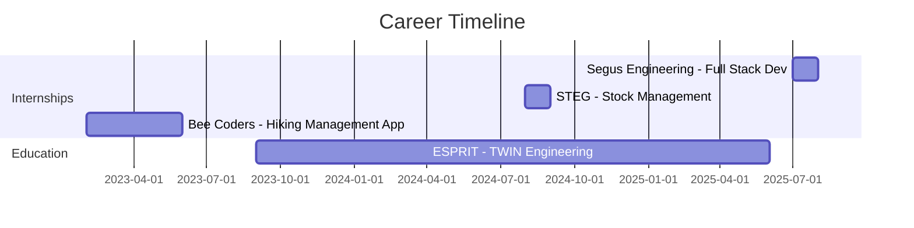

<div align="center">
  
</div>

<div align="center">
  
### 🚀 Full-Stack Engineer | 🤖 AI Enthusiast | ⚙️ DevOps Automation Lover

*Building intelligent, scalable applications with passion and precision*

[](https://linkedin.com/in/chihi-dorsaf)
[](mailto:dorsaf.chihi@esprit.tn)
[](https://github.com/chihi-dorsaf)


</div>

---

## 🎯 Quick Facts

```javascript
const dorsaf = {
    location: "Tunis, Tunisia 🇹🇳",
    education: "ESPRIT - TWIN Engineering Student",
    currentFocus: "Building AI-powered web applications",
    learning: ["Microservices", "Kubernetes", "Semantic Web"],
    lookingFor: "6-month final internship opportunity",
    funFact: "I automate everything that can be automated! 🤖",
    languages: ["French 🇫🇷", "English 🇬🇧", "Arabic 🇹🇳"]
};
```

---

## 💻 Tech Stack

<details open>
<summary><b>🎨 Frontend Development</b></summary>
<br>


</details>

<details open>
<summary><b>⚙️ Backend Development</b></summary>
<br>


</details>

<details open>
<summary><b>🗄️ Databases & Storage</b></summary>
<br>


</details>

<details open>
<summary><b>🐳 DevOps & CI/CD</b></summary>
<br>


</details>

<details>
<summary><b>🛠️ Tools & Others</b></summary>
<br>


</details>

---

## 🚀 Featured Projects

<table>
<tr>
<td width="50%">

### 🧠 MindSpark
**Skills Exchange Platform**


Collaborative platform with AI chatbot, marketplace, and gamification

**Key Features:**
- 🤖 AI-powered recommendations
- 📊 Real-time analytics dashboard
- 🔄 Complete CI/CD pipeline
- 🐳 Docker & Kubernetes

**Tech:** MongoDB • Express • React • Node.js • Flask • Jenkins • SonarQube • Prometheus

[View Project →](https://github.com/chihi-dorsaf/mindspark)

</td>
<td width="50%">

### 🌱 EcoEvent
**Eco-Friendly Event Management**


Event management platform with environmental impact tracking

**Key Features:**
- 🌍 Carbon footprint calculator
- 📈 Real-time monitoring
- 🔄 GitHub Actions CI/CD
- 📊 Advanced analytics

**Tech:** Laravel • Flask • MySQL • Docker • SonarQube • Grafana

[View Project →](https://github.com/chihi-dorsaf/ecoevent)

</td>
</tr>

<tr>
<td width="50%">

### ✈️ VestaVerse
**Travel Social Network**


Community platform for travelers to share experiences

**Key Features:**
- 🗺️ Interactive travel maps
- 📸 Photo sharing & stories
- 🤝 Traveler connections
- 🐳 Automated deployment

**Tech:** Django • MongoDB • Docker • Jenkins • Prometheus

[View Project →](https://github.com/chihi-dorsaf/vestaverse)

</td>
<td width="50%">

### 🛒 SmartCom
**Intelligent E-Commerce**


E-commerce with AI recommendations and semantic web

**Key Features:**
- 🤖 AI recommendation engine
- 🔗 Semantic web integration
- 🔍 Advanced product search
- 📊 SPARQL queries

**Tech:** Django • Python • RDF • OWL • SPARQL

[View Project →](https://github.com/chihi-dorsaf/smartcom)

</td>
</tr>
</table>

---

## 📊 GitHub Statistics

<div align="center">


</div>

<div align="center">
  


</div>

### 📈 Contribution Graph

[](https://github.com/chihi-dorsaf)

---

## 🏆 GitHub Trophies

<div align="center">

[](https://github.com/chihi-dorsaf)

</div>

---

## 🎓 Certifications

<table>
<tr>
<td align="center" width="50%">

### 🔗 Blockchain
**The Hashgraph Association**

*2025*


</td>
<td align="center" width="50%">

### ☁️ AWS Cloud Foundations
**AWS Academy**

*2025*


</td>
</tr>
</table>

---

## 💼 Professional Experience



---

## 🌟 Community Involvement

<table>
<tr>
<td width="50%">

### 🔴 Red Crescent
*2024 - Present*

- Humanitarian actions
- Community support
- Volunteer coordination

</td>
<td width="50%">

### 🤝 Coexister Club
*2023 - 2024*

- Intercultural dialogue
- Event organization
- Team collaboration

</td>
</tr>
</table>

---

## 📫 Let's Connect!

<div align="center">

### 💬 Open to collaborations and opportunities!

**Looking for a 6-month final internship starting February 2026**

<table>
<tr>
<td align="center">
<a href="https://linkedin.com/in/chihi-dorsaf">

</a>
</td>
<td align="center">
<a href="mailto:dorsaf.chihi@esprit.tn">

</a>
</td>
<td align="center">
<a href="https://github.com/chihi-dorsaf">

</a>
</td>
</tr>
</table>

</div>

---

## 💭 Random Dev Quote

<div align="center">


</div>

---

<div align="center">

### ⚡ Fun Fact

*"First, solve the problem. Then, write the code."* - John Johnson

**Thanks for visiting! Don't forget to ⭐ some repositories if you find them interesting!**


</div>
